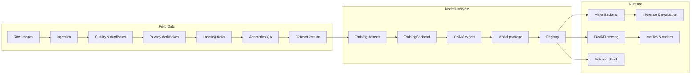
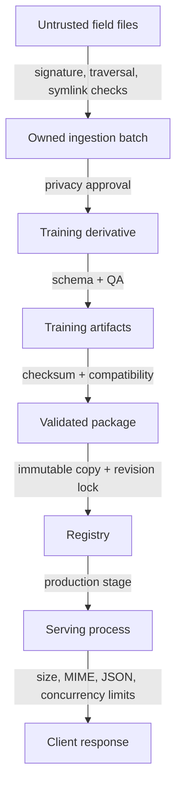

# Architecture Diagram



Text fallback:

```text
Raw → Ingest → Curate → Label → QA → Version
    → Train → ONNX → Package → Registry
    → Inference / Serving / Evaluation / Release Check
```

## Trust boundaries



상세 설명은 [Architecture.md](Architecture.md)를 참고한다.
