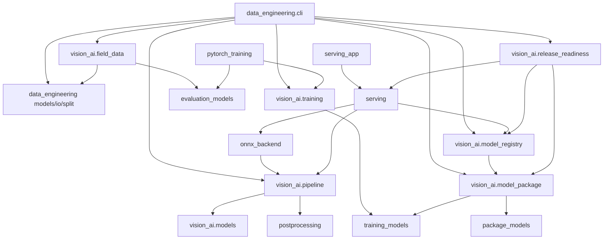
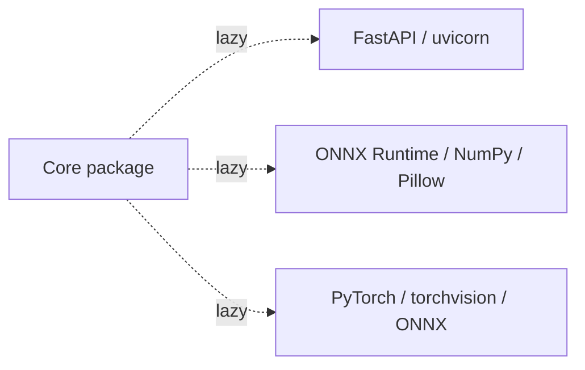

# Dependency Graph

## Internal modules

## Optional external dependencies

| Group | Packages | Import boundary |
|---|---|---|
| Core | Python standard library only | Always available |
| Test | pytest | Test execution |
| Serving | FastAPI, uvicorn, python-multipart, httpx | App factory/server/TestClient |
| ONNX | onnx, onnxruntime, NumPy, Pillow | Session/image loader/smoke fixture |
| PyTorch | torch, torchvision, NumPy, Pillow, onnx | Training and export |
| Full | 위 그룹 전체 | CI/release integration |

Core import test는 optional package가 `sys.modules`에 들어오지 않는지 검사한다.
Version 범위는 루트 `pyproject.toml`이 authoritative source다.
